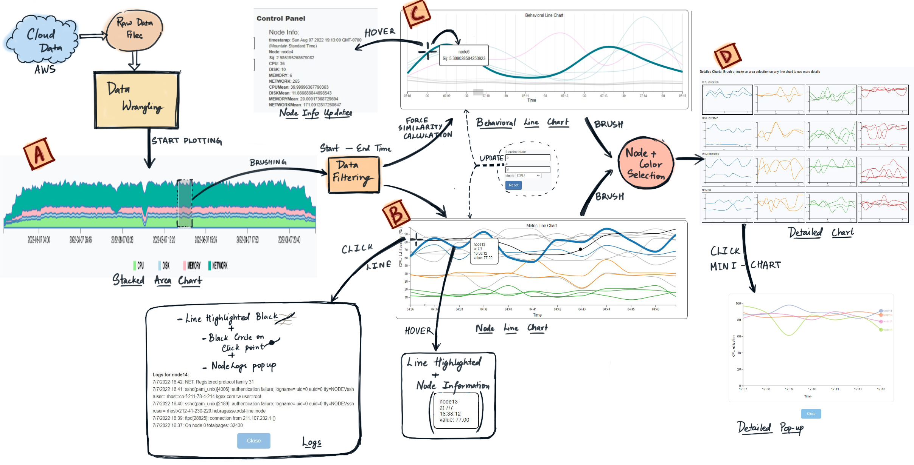

### Visual Analysis of Cloud Computing Performance Using Behavioral Lines

#### How to Install
- Clone the repository
- CD into the cloned repo
- Start the file server (Example: python -m http.server)
- Click on index.html present in the root of the project.

**Paper link**: https://ieeexplore.ieee.org/document/7422127

Useful Links:
- https://observablehq.com/@connor-roche/multi-line-chart-focus-context-w-mouseover-tooltip
- https://medium.com/@louisemoxy/how-to-create-a-stacked-area-chart-with-d3-28a2fee0b8ca
- https://bl.ocks.org/mbostock/3885211
- https://observablehq.com/@thetylerwolf/day-16-zoomable-area-chart
